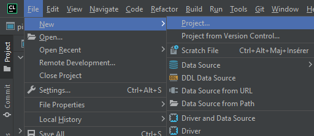
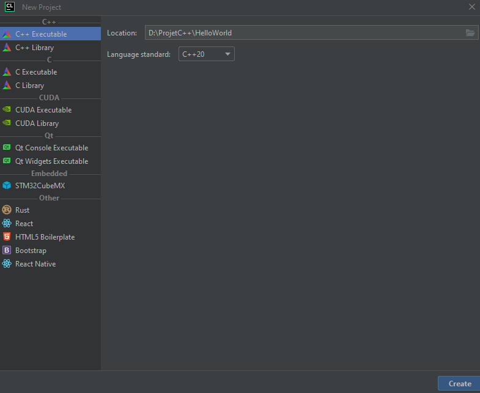

# Le C++ Pour les Pingouins

## Introduction

Bonjour mes pingouins, ce cours s'adresse aux débutants comme aux confirmés voulant approfondir des notions de C++.

Il est conseillé aux débutants de lire ce cours dans l'ordre et à ceux voulant approfondir leur connaissance du C++
d'aller directement aux notions voulues via le sommaire.

Bon il y a quand même quelques prérequis pour ce cours : avoir beaucoup de café et posséder un canard en plastique.


## Sommaire

- [Présentation du C++](#Présentation-du-C++)
- [L'IDE](#L'IDE)
- [Hello world](#Hello-world)
- [Les commentaires](#Les-commentaires)
- [Les variables](#Les-variables)
- [Initialisation des variables](#Initialisation-des-variables)
- [Base de l'input utilisateur](#Base-de-l'input-utilisateur)
- [Les opérations arithmétiques et les conversions](#Les-opérations-arithmétiques-et-les-conversions)

## Présentation du C++

Ici, ce n'est pas Wikipédia donc si tu veux lire l'historique du langage tu vas sur Google, je vais présenter seulement ce
qui va te servir pour coder histoire que les trois flemmards dans le fond ne décrochent pas.

Le C++ est un langage de programmation **compilé**, c'est-à-dire qu'à la différence d'autres langages (comme le Python
par exemple), le code n'est pas lu par un logiciel tiers, mais est transformé en un exécutable (le fameux ".exe")
directement lisible par la machine. Le logiciel permettant cette transformation est appelé "**compilateur**".

Le C++ utilise ce que l'on appelle "**la programmation orienté objet**", mais avant d'entrer là-dedans, voyons les bases.

Cette présentation est volontairement raccourcie au possible pour ne pas perdre les débutants

## L'IDE

_Cette partie ne s'adresse qu'aux débutants_

Alors c'est bien joli tout ça, mais on ne va pas coder sur word.
Pour developer on a truc qui s'appel l'**IDE**, ça veut dire _environnement de development intégré_, pour les puristes🥸
en anglais, c'est _Integrated Development Environment_. En bref, c'est un logiciel qui fait te permet d'avoir ton éditeur
de texte, ton compilateur et ton debugger tout en un.

Ici j'utilise CLion, alors cet IDE est gratuit pour les étudiants, donc si tu as une adresse mail universitaire profite,
c'est gratos pour toi, sinon il faut payer ou utiliser un autre logiciel tel que Visual Studio.

## Hello world

Bon déjà on va créer un nouveau projet :



Et vous aller choisir l'option "C++ executable" puis renommer votre projet en "HelloWorld" :



Comme CLion fait tout à votre place, il va vous créer directement le programme "Hello World" :

```
#include <iostream>

int main() {
    std::cout << "Hello, World!" << std::endl;
    return 0;
}
```

Vous pouvez compiler votre programme avec l'icône de marteau ou compiler puis exécuter votre programme avec la fleche en
haut à droite de votre écran.

Normalement après exécution de votre programme vous devriez-voir apparaitre ceci dans une console :
```
Hello, World!
```

Chouette c'est votre premier programme, je vous mentirais si je vous disais que je pouvais dès maintenant tout expliquer
sur ce programme, mais retenez que :

- La première ligne ```#include <iostream>``` sert à charger de nouvelles fonctionnalités au C++, comme celle d'afficher des messages à l'écran.
- La ligne ```int main()``` permet de créer la fonction principale de votre code, c'est à partir de là que votre code 
sera lu.
- Pour la ligne ```std::cout << "Hello, World!" << std::endl;``` le mot clé ```cout``` permet d'afficher du texte séparé par
l'opérateur ```<<``` tandis que ```endl``` permet un retour à la ligne (mais pas que 😉).
- ```return 0``` marque la fin du programme (en fait, c'est plus compliqué que ça, vous verrez dans le chapitre sur les
fonctions que je suis un peu un menteur).
- La dernière accolade permet de clore la fonction ```main```.

Vous remarquerez que le mot clé ```std::``` revient à plusieurs reprises, et que plus nous allons multiplier le nombre
```cout``` plus il va falloir l'écrire.

Une petite parade à ça consiste à inclure cette ligne dans le fichier ```using namespace std;```.

Ce qui nous donne :

```
#include <iostream>

using namespace std;

int main() {
    cout << "Salut les pingouins" << endl;
    return 0;
}

```

Vous remarquerez que chaque instruction se termine par un `;`.

Felicitation vous avez écrit votre premier programme et vous n'avez rien compris parce que j'ai simplifié au maximum,
maintenant il est temps de coder pour de vrai !

## Les commentaires

Comme dans tout langage moderne C++ permet de commenter votre code, c'est-à-dire de laisser de petits textes explicatifs
qui ne seront pas interprétés par le compilateur. Ces textes permettent à vos collègues une meilleure compréhension de
votre code et à vous retrouver plus facilement dans votre code. Le commentaire peut aussi être utilisé pour empêcher le
compilateur de lire certains morceaux de votre code lors de phase de debugging.

Il existe deux types de commentaires : les commentaires de fin de ligne et les commentaires libres.

### Les commentaires de fin de ligne

Les commentaires de fin de lignes sont introduit par C++ : ils s'écrivent avec ```\\```, tout ce qui se trouve après ces
deux characters sur une n'est plus interprété par le compilateur.

#### Exemple
```
cout << "Salut les pingouins" << endl; // Affiche du texte
// cout << "Salut les pingouins" << endl; n'affiche rien du tout 
```

### Les commentaires libres

Les commentaires libres sont hérités du C. Ils permettent de mettre plusieurs lignes en commentaire, on ouvre un
commentaire libre avec ```/*``` et on le ferme avec ```*/```, tout ce qui se trouve entre ces deux symboles se trouvent
commenter.

#### Exemple

```
#include <iostream>

using namespace std;

int main() {
    cout << "Salut les pingouins" << endl;
    /* Ceci est un commentaire
     de plusieurs lignes */
    return 0;
}
```

## Les variables

Ce chapitre étant un peu long voici un sommaire pour vous rendre directement à la partie qui vous intéresse :

- [Les types entiers](#Les-types-entiers)
- [Les entiers dans la mémoire](#Les-entiers-dans-la-mémoire)
- [Les unsigned int](#Les-unsigned-int)
- [Les types flottants](#Les-types-flottants)
- [Les types caractères](#Les-types-caractères)
- [Le type bool](#Le-type-bool)


Rentrons maintenant dans le vif du sujet, qu'est-ce qu'une variable ?
Les variables sont des éléments qui associe un nom à une donnée physiquement implanté dans la mémoire de la machine.

Il existe différents types de variables, voyons les types de base : 

| Type de variable | Signification               | Taille en octets | Plage de valeur valide   |
|------------------|-----------------------------|------------------|--------------------------|
| int              | Nombre entier               | 4                | -2147483648 à 2147483647 |
| short int        | Entier court                | 2                | -32768 à 32767           |
| float            | Flottant (nombre à virgule) | 4                | 3,4E-38 à 3,4E+38        |
| double           | Flottant double             | 8                | -1.7E-308 à 1.7E308      |
| long double      | Flottant double long        | 10               | 	-3,4E-4932 à 3,4E4932   |
| bool             | Booléen                     | 1                | 0 ou 1, faux ou vrai     |
| char             | Caractère                   | 1                | 	-128 à 127              |

**Remarque** : _Je n'ai volontairement pas mis les types unsigned qui feront l'objet de leur propre partie ni les type
qui n'ont leur utilité que sur des processeurs 16 bits._

Alors j'en vois déjà certains se cacher en se demandant "c'est quoi ce truc ?" mais pas de panique nous allons voir les 
types un par un.


### Les types entiers

On peut trouver jusqu'à quatre tailles d'entiers différents grâces aux mots clés suivants : **short int**, **int**,
**long int**, **long long int**. 
Ces termes peuvent être abrégés respectivement par: **short**, **int**, **long**, **long long**.

Chaque taille a ses limites (se référer au tableau ci-dessus) attention cependant en fonction du processeur utilisé les 
type entiers ont des valeurs pouvant être différentes de celle du tableau.

#### Les entiers dans la mémoire

**Remarque** : cette partie n'est pas indispensable à qui veut coder, cependant elle est nécessaire pour comprendre les
opérations réalisées par votre ordinateur.

Travaillions avec le type le plus petit chez les entiers : le short. Le short s'écrit sur deux octets donc 16 bits (un
octet correspond à 8 bits) mais les notions que nous allons voir se généralisent à tous les types entiers.

Accroche ta cafetiere on va faire du binaire !


**Positif ou négatif ?** : bon déjà tu prends le bit de poids fort (le bit le plus à gauche), s'il est à 0, c'est positif,
mais s'il est à 1, c'est négatif. Exemple `00000000 00000001` c'est positif et égal à 1, `00000000 00000011` est égal à 
3, pour les nombres négatifs le bit de poids fort est à 1 et la valeur est maintenant codé en suivant la technique
du complément deux. Pour ça on exprime la valeur absolue en base de deux puis on la rend négative en passant tout les 0
à 1 et tout les 1 à 0, puis on ajoute une unité au résultat, exemple : `11111111 11111111` est égal à -1 et 
`11111111 11111101` est égal à -3.

#### Les unsigned int

Bon mes pingouins en fait je suis un peu un menteur, j'ai oublié de vous parler du mot clé **unsigned**.


Ce mot clé signifie que notre variable sera forcément positive, donc on oublie le délire du bit de poids fort pour
déterminer le signe, ce sera toujours positif.

On va prendre un **short**, en temps normal sa plage de données va de -32768 à 32767, bon bas là tu oublies la partie
négative et tu doubles la plage positive ce qui donne une plage allant de 0 à (32767 * 2 + 1) soit 0 à 65535.

### Les types flottants

Les types **flottants** dîtes-vous ?


Les types flottants sont basiquement une représentation approchée d'un nombre réel (nombre à virgule tsé).
Il existe plusieurs types de float en fonction de la taille qui leur est alloué de la même manière que pour les types
entiers : **float**, **double** et **long double**.

**Remarque** : de la même manière qu'il existe des entiers non signés (unsigned) il en va de même pour les flottants,
vous pouvez doubler la taille de la plage positive au prix de la plage négative avec ce mot clé.

**Remarque** : _la suite de cette partie s'adresse à ceux voulant approfondir la notion de nombre flottant._

Les types flottants s'inspirent de la notation scientifique où un nombre s'écrit sous la forme 3,8x10⁴.
On appelle **mantisse** (M) la valeur qui est le facteur d'une puissance de 10. On appelle exposant (E) la puissance de 10.
Chaque flottant est représenté par **M.B^E** où B représente la base de la machine (soit 2, soit 16).

### Les types caractères

En C++ les caractères sont codés sur un octet est déclaré avec le mot clé **char**.

### Le type bool

Bon ça, c'est le type le plus simple, en fait, c'est une variable qui ne peu prendre que deux valeurs : vrai ou faux.
Cette variable est codée sur un octet et se déclare avec le mot clé **bool**.
On y associe les deux mots-clés suivants : **false** et **true** pour exprimer la valeur qu'elle contient.

## Initialisation des variables

Bon, j'en vois s'impatienter parce que j'explique des trucs, mais on ne code pas beaucoup. 


C'est pour ça que maintenant nous allons voir l'initialisation des variables.

Chaque type de variable s'initialise avec les mots-clés vu précédemment (nous allons revenir dessus).

Déclarons dans `main` une variable `x` : `int x;`

Lorsque l'on déclare une variable de la sorte, sa valeur est inconnue et donc le programme est imprévisible :

```
int main() {
    int x;
    cout << x << endl; // La valeur affichée est imprévisible
    return 0;
}
```
Il est conseillé d'initialiser explicitement les variables lors de leur déclaration avec l'opérateur **=** : 
```
int x = 10;
cout << x << endl; // Affiche 10
```
Nous pouvons déclarer plusieurs variables à la fois en séparant chaque nom de variable par une virgule :
```
int x, y, z;
```

Nous pouvons aussi les initialiser en même temps, l'initialisation se fait de la droite vers la gauche : 
```
int x = y = 2; // y est initialisé à 2, x est initialisé par y
```

### Initialisation par parenthèses

Pour le moment cela ne nous est pas très utile (mais ça le sera dans le chapitre sur les patrons de classe), mais nous
pouvons initialiser notre variable de la sorte : 
```
int x (2);
```

### Initialisation par accolades

Nous pouvons aussi initialiser par accolade : 
```
int x { 2 };
int y = { 2 };
```

Attention toute fois, les accolades n'autorisent pas d'**initialisation dégradante**, c'est-à-dire que le compilateur
va refuser l'initialisation s'il y a une perte de donnée lors de celle-ci :
```
int x = 2.5; // Conversion dégradante, nous perdons la partie après la virgule
cout << x << endl; // Affiche 2
int y = { 2.5 }; // Refusé par le compilateur
```

**Remarque** : il existe deux mots clés que nous n'avons pas encore vu pour l'initialisation des variables, il s'agit 
d'**auto** permettant de définir automatiquement le type de la variable et le mot clé **const** empêchant
la modification de la variable. Nous utiliserons ces mots-clés plus tard.

## Base de l'input utilisateur

Alors c'est bien marrant tout ça, mais si l'utilisateur ne peut rien taper on perd pas mal d'utilités à nos programmes,
je vais donc vous montrer comment l'utilisateur peu faire une entrée clavier.
Nous allons utiliser le flux d'entrée standard de C++ contenu dans l'entête `<iostream>`.
```
int x;
cout << "Tapez un nombre: "; // Pas de endl ici pour ne pas faire de retour à la ligne
cin >> x;
cout << x << endl;
```
output : 
```
Tapez un nombre: 5
5
```
## Les opérations arithmétiques et les conversions

Ce chapitre va vous présenter les différents types d'opération arithmétiques et leur priorité, si tu as un minimum bossé
au college, tu devrais connaitre tes priorités arithmétiques, mais un bref rappel ne fera pas de mal.
Fait toi un bon café et suit attentivement cette partie, elle te sera utile pour tout le reste.


### Les opérateurs "+" et "-"

Bon, gros malin, tu l'as sûrement deviné, tu peux faire des additions et des soustractions, ces opérateurs sont de
priorité équivalente. Comme en mathématique, tu peux te servir des parenthèses pour changer l'ordre des priorités.
Exemple : 
```
int x = 10 - 2 + 3: // x = 11
int y = 10 - (2 + 3); // y = 5
```

### Les opérateurs "*" et "/"
